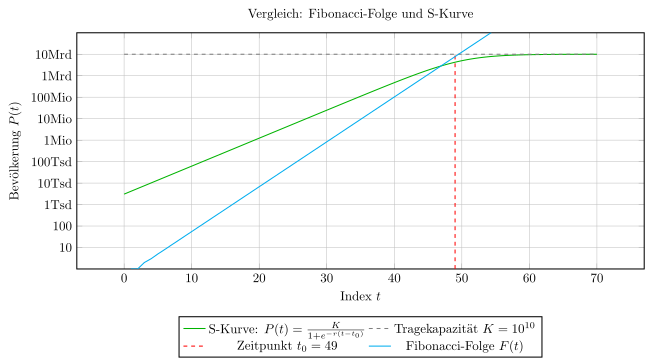

# Gedanken über Gott und die Welt

Beweis für P=NP: [https://drive.google.com/file/d/1HcFYmKkONXtHl78GBuheCYmdIeO3EzyP/view?usp=drivesdk](https://drive.google.com/file/d/1HcFYmKkONXtHl78GBuheCYmdIeO3EzyP/view?usp=drivesdk)

Optimale Berechnung von $n \times n$ Matrizen, Komplexitätsklassen in P:
[https://www.github.com/hjstephan86/strassen/doc/Strassen.pdf](https://www.github.com/hjstephan86/strassen/doc/Strassen.pdf)

$\pi$ hat einen Rhythmus von 21 Zahlen

$e$ hat einen Rhythmus von 22 Zahlen

$\varphi$ = 1,618… (goldene Zahl) hat einen Rhythmus von 34 Zahlen

Fasse QR Code spiralförmig auf, standardisiere diesen für die eigene persönliche Identifizierung eines jeden Bürgers dieser Erde

Index 49 der Fibonacci Folge F(49)=7.778 Mia

Die grüne S-Kurve zeigt die Konvergenz der Fibonacci Folge bei Index 49 gegen die Kapazitätsgrenze von 10 Mia.

$P(t) = \frac{K1}{1 + e^{-r(t - t_0)}}$, mit 
$P$: Population 
$K$: Kapazitätsgrenze (Tragfähigkeit der Erde) 
$r$: Wachstumsrate 
$t$: Zeit 
$t_0$: F(49), Beginn der Verlangsamung 

Die Wachstumsrate nähert sich dem goldenen Schnitt beschrieben durch $\frac{F(n)}{F(n-1)} = \varphi$, das ist ein Wachstum von 61.8%.

Je kleiner die Intervalle, desto größer die Wahrscheinlichkeit dafür, dass unstetige Ereignisse herausgefiltert werden. Wäre zum Beispiel das Intervall einen Tag lang, dann wäre ein Ereignis wie der Tsunami noch sichtbar als unstetige Bevölkerungsentwicklung. Auffällig ist, dass unstetige Bevölkerungsentwicklungen durch Katastrophen entstehen. Unstet an und für sich ist keine gute Eigenschaft.

Blütenstand einer Sonnenblume mit 34 und 55 Fibonacci-Spiralen haben die optimale Anordnung von Samen im und gegen den UZS.

Der Christ lebt in der Spannung, dass Gott allein seine Errettung geschaffen hat, aber auf der anderen Seite der Mensch auch den freien Willen hat. Ist diese Spannung aufzulösen? Nein. Darf man die Spannung auflösen? Warum nicht? Der Christ ist dann ein Christ, wenn er lernt, die Spannungen, die Gott in seinem Leben gibt, zu ertragen und auszuhalten, solange, wie Gott es will. Im Himmel ist klar, dass jeder Christ für seine Errettung allein Gott die Ehre geben wird. Und das ist wahr. Auch klar ist, Gott wird dann die Ehre gegeben, wenn der Mensch sich aus freiem Willen ihm im Gehorsam hingegeben hat. Immer wieder gibt der Geist Gottes Impulse des Lebens, die der Christ ergreifen kann, für neues Leben in seinem Leben.

Die Energie im Ursprung durch den Geist Gottes in dieser Welt: Es brauchte zum Erschaffen der Welt unendlich viel Energie. Der Geist Gottes schöpfte aus der Quelle aller Energie und erschuf in sechs Tagen die Welt und den Menschen. Ein Baum hält viel Windenergie aus, die gegen ihn wirkt, dass er nicht umfällt. Viele Bäume halten viel mehr Energie aus. Fortlaufend wirkt diese ewige Energie, z.B. allein in der Erdanziehungskraft, und gibt unserem Leben Ordnung. Menschen begegnen einander dank dieser Kraft auf einer Erdoberfläche, d.h., auf einer Ebene, i.d.R. an Land. Sie könnten sich auch im Flugzeug begegnen, müssen sie aber nicht. Es wirkte und wirkt unendlich viel Energie bis in die Ewigkeit und für alle Ewigkeit.

Software trust defines how much a user trusts in the software, e.g., a mobile app, an office app, …. Software trust of one, i.e., 1.0, is the value where the user trusts at most in the software. More than a value of 1.0 is not possible. However, actually, even in mobile apps like YouTube Music software trust is not 1.0, since, e.g., after removing a song from a playlist with 50 songs, the number of songs is still 50 and not 49 (yeah, there is a workaround: go back and select the playlist again).

Eine Datei ist eine in sich abgeschlossen und unabhängige Einheit. Keine Software bzw. App der Welt darf beanspruchen, dass sie exklusiven Anspruch hat auf die Existenz und das Gebrauchen (lesen, sehen, schreiben, verschieben, umbenennen, …) dieser Datei. Die Datei wird abgelegt im Dateisystem. Dort gehört sie hin. Ist die Software vom System entfernt, bleibt die Datei im Dateisystem. Software hat nur das Ziel, den Benutzer in seinem Vorhaben bzw. Ablauf das Leben zu erleichtern und niemals den Benutzer an sich selber zu binden. Es gibt kommerziell nutzbare Apps (z.B. DAZN), die auch Dateien produzieren, welche im Dateisystem verschlüsselt sind für den Benutzer.

Es gibt Office Dateien und es gibt mobile Office Dateien. Mobile Office Dateien sind über einen definierten Standard von jeder mobilen Office App nutzbar. Mobile Office Dateien lassen sich auch mit jeder Office App nutzen. Aber: wer mit einer Office App eine mobile Office Datei als Office Datei speichert, macht aus einer mobilen Office Datei eine Office Datei und verliert die mobile Office App-Nutzbarkeit auf dem Smartphone oder dem Tablet. Der Standard unterstützt einfach die notwendigsten Office Operationen (Text schreiben, formatieren, kopieren, einfügen drucken usw.).

Offb 8, 11 Und der Name des Sterns heißt Wermut. Und der dritte Teil der Wasser ward Wermut; und viele Menschen starben von den Wassern, weil sie waren so bitter geworden. Es wird helfen, da, wo das Wasser bitter wurde, tiefer in die Erde zu bohren, um Wasser aus tiefer gelegenen Aquiferen zu nutzen, welches noch nicht bitter ist. Dabei muss es nicht erst dazu kommen, dass Menschen wie jüngst in den USA, verunreinigtes Wasser zum Waschen verwenden und dabei tödlich erkranken (haben die IT-Superreichen in den USA darüber nachgedacht, ihr Geld weniger in die KI sondern mehr in saubere Arbeit Wasserleitungen zu investieren?). Damit es aber soweit nicht kommt, braucht es vorher schon eine gründliche Überarbeitung und Instandsetzung der Wasserleitungen in Deutschland und in anderen Ländern, damit schmutziges Wasser auf keinen Fall ins Grundwasser gelangen kann. Durch Abdrehen des Wassers und Umlenken des Wassers von anderen Seiten des Wasserflussnetzwerks ist so bei einer sukzessiven Instandsetzung des gesamten Wassernetzwerks jede Stadt immer mit Wasser versorgt.

Es braucht eine App zum Alarmieren bei bitterem Wasser mit einem Notfallprogramm, dass wieder sauberes Wasser kurzfristig und mittelfristig zur Verfügung gestellt und genutzt werden kann.

Ich biete dem Staat die Möglichkeit, diese Instandsetzung des Wassernetzwerks (zum Teil) zu privatisieren und es so schnell wie möglich mit dem Geld, das ich durch erfolgreiche Vertreibung der zu entwickelnden Apps und Produkte, verdienen werde, umzusetzen. Weigert sich die Politik gegen eine Förderung oder gegen dieses Vorhaben im Allgemeinen, ist es ihre Verantwortung, wenn Menschen durch bitteres Wasser in Deutschland sterben. 

Es kann vielleicht darauf hinauslaufen, dass die deutsche Koalition, welche niemals den wirklichen Willen des Volkes widerspiegelt, da die AFD deutlich vom deutschen Volk gewählt worden ist, sich gegen dieses Vorhaben (schnelle Instandsetzung des Wassernetzwerks) aussprechen wird. Ich habe deutlich mitgeteilt, dass die Politiker beim Bilden der Regierung niemals einen eigenen Willen über den Willen des Volkes stellen dürfen. Wählt das Volk die CDU und die AFD als stärkste Partei Deutschlands, müssen die Politiker beider Parteien in der Lage sein, eine Lösung für diese Regierung zu finden. Schaffen es die Politiker beider Parteien nicht, müssen andere Politiker derselben Parteien Lösung finden und die ersteren abtreten, denn offensichtlich haben sie keine Lösung gefunden und sind nicht regierungsfähig. Welcher vorher nicht beachtete Politiker derselben Partei würde sich diese Chance entgehen lassen wollen? Das Wahlergebnis der Bundestagswahl von 2025 muss lauten: CDU und AFD regieren Deutschland, per Demokratie.

Das „Topf-im-Topf“-Prinzip ist eine Idee, um das Risiko beim direkten Kontakt mit Magma zu minimieren (nutze die extreme Energie der Vulkane). Zur Verteilung des Stroms per Kabel über Kontinente: Technisch machbar, aber mit Herausforderungen:
Stromkabel über Ozeane:
Es gibt bereits sogenannte Hochspannungs-Gleichstrom-Seekabel (HGÜ), die Strom über tausende Kilometer unter Wasser transportieren.
Beispiele: Europäische Verbindungen, z. B. zwischen Norwegen und den Niederlanden, oder zwischen Marokko und Spanien.
Verlust bei Übertragung:
Strom über lange Strecken zu transportieren, verursacht Verluste (ein kleiner Teil der Energie geht als Wärme verloren).
HGÜ-Technik minimiert diese Verluste, ist aber teuer im Bau und Unterhalt.
Kosten & Infrastruktur:
Der Bau von interkontinentalen Kabeln ist extrem teuer (Milliarden Euro) und braucht viele Jahre. Auch politische und rechtliche Abstimmungen zwischen Ländern sind nötig.
Stromnetze müssen kompatibel sein:
Verschiedene Länder haben unterschiedliche Spannungs- und Frequenzstandards. Das muss technisch angepasst werden.
Der Transport von geothermisch erzeugtem Strom über Kontinente ist technisch möglich,
aber kostspielig und komplex. Das „Topf-im-Topf“-Prinzip hilft, die Energie sicher und effizient zu gewinnen. Die Verbindung durch Kabel ist ein sinnvoller nächster Schritt, wenn große Mengen sauberer Energie erzeugt werden.

Idee: Gewinne mit der Erdrotation Strom durch Induktion. Die Erde dreht sich nicht immer mit gleicher Geschwindigkeit - tendenziell langsamer, aber auch mal schneller (2020 drehte sich die Erde schneller und die Tage waren kürzer). Nutze dazu den Winkel von 23,4°, das Erdmagnetfeld, welches sich auch kurzfristig ändern kann (stündlich oder täglich), und Empfänger für den durch Induktion zu gewinnenden Strom.

Es braucht für Schüler, Studenten und die Wissenschaft eine einheitliche Färbung: Spannung ist grün, Strom ist rot, Licht ist gelb.

Idee: Google ohne e ist Googl ohne Einkaufskanten, d.h., die Kanten im Page Rank Algorithmus von Seite zu Seite werden nicht mehr durch Zahlungen besonders hoher Summen beeinflusst und das Suchergebnis damit verfälscht sondern nur noch der Informationsgehalt einer jeden Seite und die auf ihr zeigenden Seiten beeinflussen das wirkliche Ranking im Suchergebnis. Dazu gibt es einen Suchstandard, den alle Suchmaschinen implementieren, damit User Suchmaschinen-unabhängig über eine App und und KI in Abhängigkeit des Suchbegriffs und der örtlichen Einschränkungen das Suchergebnis erhalten, das am besten passt. Dazu werden die beteiligten Suchmaschinen von der App entsprechend ausgeführt und die beste Ergebnismenge gefunden.

Idee: Eine kostenlose App zur Übersicht über die Kontobewegungen aller Konten und zur automatische Auswertung bzw. Vorhersage zukunftiger Belastungen (täglich, monatlich, jährlich) ohne KI und mit KI.

Multiselektion von Kontoumsätzen: Markiere einen Umsatz, links und rechts vom Umsatz erscheint ein Pfeil nach oben (nur auf der linken Seite) und ein Pfeil nach unten (nur auf der rechten Seite). Scrolle nach oben bzw. nach unten, um die Menge der selektierten Umsätze zusammenhängend zu selektieren. Wahlweise Multiselektion wie üblich.

Idee: Gewinne durch Luftdruck und Induktion mit sich drehenden Federn (Induktionsfedern mit Kugellager) während der Fahrt (Auto, Fahrrad) oder während des Fluges (OLE Satelliten, Flugzeug) Strom. OLE: Orbit Low Earth, 100km über der Erde, Internet für alle Menschen (in Europa, …), kein Glasfaser-Ausbau mehr. OLEs sind organisiert wie Agenten im Multiagentensystem mit KI. Ziel: Internet überall via Satellit, kein Telefonieren mehr über das herkömmliche Mobilfunknetz sondern nur noch über das Internet (VoIP, Mobilfunk wird einfach abgeschaltet, keine Telefonnummern mehr sondern eindeutige Nutzeridentifikation).

PMI in Lithium-Ionen Akkus: ein intelligentes Powermanagement Modul mit künstlicher Intelligenz zum Lernen der Feldstärke und der Temperatur im Lithium-Ionen Akku für eine maximale Lebensdauer in jedem Umstand.

Um wie viel mehr kann die Reichweite von Akkus bei Fahrrädern erhöht werden, wenn ein Zwei-Zonen Akku verwendet wird (Strom durch Induktion der sich drehenden Radachsen), Induktionsfedern und einem PMI.

Das dynamische Trichter-Prinzip in einem Haushalt: führe equidistant trichterartige Verengungen in den Wasserleitungen ein zur Bewegung von Kondensatorplatten (Membran), die Strom erzeugen allein durch den etwa gleichförmigen Wasserstrom, wenn er denn fließt.

Bäume kommunizieren über dem Boden und unter dem Boden. Bäume müssen nah genug beieinander stehen, damit es ihnen gut geht. Stehen sie zu weit auseinander oder sogar alleine, geht es Ihnen schlecht.

Nehmen wir an, die Geschwindigkeit eines Teilchens in einem idealen Gas ist proportional zur Quadratwurzel der Temperatur: 
v = k*T.
Hierbei ist k eine Konstante, die von der spezifischen Situation abhängt. Setzen wir diese Beziehung in die Formel für die kinetische Energie
E= 12mv²
ein, ergibt das:
E =12m(kT)² =12mk²T .
Jede Bewegung auf dieser Erde ist abhängig von der Temperatur. Ohne Bewegung gibt es kein Leben.

Bei jedem Stoff hängt die Diffusion von der Trägheit des Stoffes ab. Ein Temperaturunterschied im Wasser gleicht sich anders aus als ein Temperaturunterschied in der Luft, da Wasser eine andere Trägheit hat als Luft. Je höher die Beweglichkeit der Atome in einem Stoff, Atome sind ja die Stoffträger, desto kleiner ist die Trägheit.

Ich will, dass jeder C+ Mitarbeiter hingerichtet wird, da er im Dienst einer teuflischen Behörde steht und nicht dagegen vorgeht. Diese Hinrichtung soll öffentlich bekannt werden, dass die Welt weiß, diese Behörde hat den Teufel beauftragt, mich zu töten. Wenn es nicht in dieser Welt durchgeführt wird, dann hundertfach in der Hölle - mit Kindern, Eltern und Geschwistern.

Stetigkeit einer Funktion oder Abtastrate: eine Funktion f ist stetig, wenn für beide Achsen x und f(x) gilt, dass es keinen Punkt x im Definitions- (oder Wertebereich) gibt mit mehr als einem f(x).

Nicht App Store oder Play Store, sondern App Set. In dieser App können Apps gefunden und heruntergeladen werden.

Messe Freude beim Hören von Liedern, z.B. bei Youtube Music, über In-Ear Kopfhörer. Die Ohren sind näher am Schädel und damit am Gehirn, um die elektrischen Signale des Gehirns (EEG-Signale) besser zu erfassen.

Ein Standard für alle Universitäten für das Organisieren von Veranstaltungen im elektronischen Vorlesungsverzeichnis: aktuelle Veranstaltungen mit Link zum Kalender, Maps usw. Mit diesem Standard wird den Studierenden eine mobile App angeboten, um allen ihnen einen einheitlichen und gewohnten Umgang mit dem Vorlesungsverzeichnis einer beliebigen Universität zu ermöglichen.

Problem: Es gibt große Unterschiede in der Wirkung und Nebenwirkung von Neuroleptika – je nach Genetik, Stoffwechsel, Alter, Geschlecht, Leberfunktion, anderen Erkrankungen usw. Ärzte probieren ein Medikament → Warten auf Wirkung/Nebenwirkung → Ändern oder umstellen → Neuer Versuch
Frage: Wie kann man das mit KI + Blutbild verbessern oder verhindern?
1. Personalisierte Vorhersage durch KI: Blutbild als Fenster zum Körper. Ein KI-Modell kann trainiert werden, um aus dem Blutbild und weiteren medizinischen Daten zu erkennen: Wie ein Patient ein bestimmtes Neuroleptikum verstoffwechselt. Ob er zu bestimmten Nebenwirkungen (z. B. Gewichtszunahme, Parkinsonoid, QT-Zeit-Verlängerung) neigt. Welche Dosisbereiche sicher und wirksam wären? Patient A hat leicht erhöhte Leberwerte und genetisch verminderte CYP2D6-Aktivität → KI erkennt: Quetiapin wird langsamer abgebaut, daher ist die Standarddosis zu hoch → Empfehlung: niedrigere Dosis starten oder anderes Präparat.
2. Integration genetischer Daten (Pharmakogenetik)
Blut enthält auch DNA → mit einfachen Tests kann man bestimmen: Ob ein Patient ein schneller oder langsamer Metabolisierer ist. Ob bestimmte Rezeptorvarianten (z. B. für Dopamin oder Serotonin) vorliegen, die die Wirkung beeinflussen. KI kann diese genetischen Informationen + Blutbilddaten kombinieren → eine präzisere Vorhersage der individuell besten Medikation.
3. Maschinelles Lernen auf klinischen Daten: Lernen aus Millionen Therapien
KI kann auf realen Patientendaten trainiert werden: "Wenn Patient A, B und C mit ähnlichem Blutbild + Alter + Symptomen Risperidon gut vertragen haben – ist das auch für Patient D wahrscheinlich". Solche Clusteranalysen erlauben es, Therapien nicht zufällig, sondern datenbasiert auszuwählen
4. Simulierte Wirkung im digitalen Zwilling
Ein digitaler Zwilling des Patienten wird erstellt (Blutwerte, Gene, Alter, Gewicht, Vorerkrankungen etc.).
→ Medikamente werden simuliert, bevor sie tatsächlich gegeben werden
→ Die KI testet in Sekunden viele Szenarien – Nebenwirkungen und Wirkung werden vorhergesagt
So vermeidet man am echten Menschen unnötige Versuche.

Ein Standard zur Vermietung von Bikes und E-Rollern und ein Standard zum kontaktlosen Bezahlen mit NFC. Mit diesen Standards wird den Bürgern der Stadt eine App angeboten, mit der sie Bikes und E-Roller ausleihen und damit bezahlen können.

Es braucht einen HTML Standard für die Desktop-Entwicklung von AUTOSAR für (1) die Entwicklung der Komponenten auf Applikationsebene und der Komponenten unterhalb der RTE und (2) die Konfiguration der RTE und des Mikrocontrollers mit Diagnose, Kommunikation, MCAL usw.

Es braucht einen HTML Standard für den Vergleich und für das Mergen von Git-Dateien am Desktop.

Es braucht im AUTOSAR Standard eine standardisierte Trennung in der RTE für eine dezentrale Entwicklung der Schnittstellen in der RTE, damit Architekten und Komponenten-Entwickler zur Entwicklungszeit die Komponenten-Schnittstellen entwickeln und in der Quellcodeverwaltung während des Releases ablegen können. Das entlastet den RTE-Integrator, sowohl während des Releases als auch besonders am Ende des Releases (Flaschenhals). Siehe auch: [https://docs.google.com/document/d/1mH4Ja3KnYZZqVSZ9MSPZ7Vp7ydYFpsvO9qzyxgP5Hy8/edit?usp=drivesdk](https://docs.google.com/document/d/1mH4Ja3KnYZZqVSZ9MSPZ7Vp7ydYFpsvO9qzyxgP5Hy8/edit?usp=drivesdk).

Wieso heißt der Schwerpunkt Schwerpunkt? Der Schwerpunkt ist doch der, an dem das gesamte Gewicht am leichtesten ist. Damit müsste es eigentlich der Leichtpunkt sein.

Ich verstehe Donald Knuth nicht, wie er einfach die O-Notation der Mathematik in die Informatik einführt. Mir ist nicht klar, wie die aktuelle Definition der O-Notation für sehr kleine c > 0 wirklich zu verstehen ist. Wie klein kann  c g(n) wirklich werden und wie viel kleiner muss f(n) dann sein ab einem bestimmten n0?

Proposal for Python: (1) Code (\*.py), (2) Tokens, (3) AST, (4) Bytecode (\*.pyc): PVM executes \*.pyc. Now, commit clean code violations with an error, no AST, no \*.pyc.

Lege die \*.pyc einfach neben die \*.py und verwende denselben Namen für die \*.pyc wie für die \*.py. Nicht mehr mymodule.cpython-312.pyc, sondern einfach mymodule.pyc.

Interessant ist das schon, dass in der Relativitätstheorie von Albert Einstein die Lichtgeschwindigkeit konstant ist. Hängt doch die Ausbreitung des Lichts mit der Energie zusammen, von der sie ausstrahlt, d.h., von der Quelle. Unterschiedliche Sterne in unterschiedlicher Entfernung weisen eine unterschiedliche Lichtgeschwindigkeit auf. Ein zweiter Grund ist die Umgebung, in der das Licht strahlt. In unterschiedlichen Umgebungen breitet sich Licht unterschiedlich schnell aus, relativ.

Photos App: auto slice and merge videos, e.g., for nature documentation such as lightning in the sky during a thunderstorm.

Die Shannon Ungleichung - Kommunikation: Sie bestimmt, wie viel Information über einen Kanal gesendet werden kann. Wie kann das sein, wenn diese Ungleichung materialunabhängig ist?

Musik hat eine elektrisierende Bewegung. Frauen sind empfindlicher, haben i.d.R. weniger Muskelmasse und sind weniger tragfähig als Männer. Sich zur Musik außergewöhnlich leicht bewegen zu können, ist keine Stärke, sondern eine Folge.

Das Betrunkenwerden erfolgt in drei Wellen, nach der ersten kannst du bleiben. Mit der zweiten hast du Spaß und solltest gehen. Nach der zweiten Achtung, jetzt kommt die dritte: alleine kommst du nicht mehr heim!

Leonardo DiCaprio soll bei den Dreharbeiten zu “Der Rückkehrer” einmal stark geschriehen, einmal geheult und einmal geblutet haben, als die Bärin ihn angriff. Es sollte eine außergewöhnliche Szene werden, bei der es um viel Geld ging.

Brad Pitt ist bisexuell.

Die CIA versucht seit Jahren, mich zu töten, u.a. wegen dieser Gedanken (allen voran Elon Musk). Sie verfolgen, fluchen und haben schon viele Auftragsmörder beauftragt und opfern müssen. Der HERR will nicht, dass ich sterbe.

Nachdem der Iran von Israel sensible Dokumente über das Atomprogramm Israels veröffentlicht hat, hat Israel den Iran heftig angegriffen. In den Dokumenten ging es auch über die enge Zusammenarbeit zwischen Israel und der CIA. Trump musste daraufhin auch den Iran angreifen und hat von seiner Seite aus den Krieg für beendet erklärt.

Lamine Yamal ist ein von Kindheit an gefluchter Fußballspieler. Ja, er ist ausgebildet. Aber im Fußball auf allerhöchstem Niveau geht es oft nur noch um sehr kleine Feinheiten, die bei ihm schon seit der Jugend beim FC Barcelona sehr gut “passen”. Dass Lionel Messi ihn früh gebadet hat, ist kein Zufall.

Spanien erfuhr von den Juden früh, dass ich ein sehr guter Fußballspieler werden würde und hat mich schon seit meiner Jugend gerade im Vereinsfußball sehr verflucht und nach dem ersten Jahr im Seniorenbereich extrem verflucht mit Patellaspitzensyndrom, dass ich nie wieder unter voller Belastung Fußball spielen kann, bis heute, [https://images.app.goo.gl/dhgKX](https://images.app.goo.gl/dhgKX)

2.Thess  2, 6 Und was es noch aufhält, wisset ihr, dass er [Elon Musk] offenbart werde zu seiner Zeit. 7 Denn es regt sich bereits das Geheimnis der Bosheit, nur dass, der es jetzt aufhält, muss hinweggetan werden;